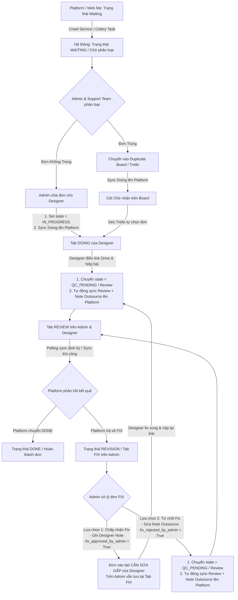

# TÀI LIỆU QUY TRÌNH & LUỒNG XỬ LÝ ĐƠN HÀNG (ORDER WORKFLOW SPECIFICATION)

> **Dành cho Agent & Developer**: Tài liệu này mô tả chi tiết và chuẩn xác 100% toàn bộ vòng đời của một đơn hàng trong hệ thống từ lúc crawl từ Platform (web mẹ) về, phân loại, chia đơn, xử lý thiết kế, nộp bài, duyệt review cho đến xử lý fix (chấp nhận fix / từ chối fix) và hoàn thành (Done).

---

## 1. TỔNG QUAN HỆ THỐNG & CÁC VAI TRÒ (ROLES)

Hệ thống quản lý đơn hàng kết nối 2 chiều với Platform gốc (Printerval/web mẹ) và hỗ trợ 4 nhóm vai trò chính:

| Vai trò (Role) | Mã Role (`user.role`) | Trách nhiệm chính |
| :--- | :--- | :--- |
| **Admin** | `admin` | Toàn quyền hệ thống: crawl đơn, phân loại đơn trùng/không trùng, chia đơn cho designer, duyệt/từ chối fix, cấu hình hệ thống. |
| **Support Team** | `support` | Hỗ trợ phân loại đơn trùng / không trùng, kiểm tra trạng thái đơn hàng. |
| **Designer thường** | `designer` | Nhận đơn do Admin phân công vào tab **Doing**, làm mẫu thiết kế, nộp link Drive hoàn thành sang **Review**, nhận lại đơn sửa tại tab **Cần sửa gấp (Fix)** nếu Admin duyệt fix. |
| **Designer Trello** | `designer_trello` | Hoạt động trên Board đơn trùng (Duplicate Board), tự chọn/kéo đơn về cột của mình, các bước làm bài, nộp link, sửa bài giống hệt Designer thường. |

---

## 2. SƠ ĐỒ TỔNG THỂ VÒNG ĐỜI ĐƠN HÀNG (STATE MACHINE DIAGRAM)



---

## 3. CHI TIẾT CÁC GIAI ĐOẠN (PHASES)

### GIAI ĐOẠN 1: CRAWL ĐƠN TỪ PLATFORM (WEB MẸ)
1. **Nguồn đơn**: Hệ thống chạy worker (Celery task `crawl_waiting_orders`) hoặc Admin bấm nút cào đơn thủ công để quét danh sách đơn hàng có trạng thái `Waiting` trên Platform.
2. **Dữ liệu thu thập**:
   - Mã đơn hàng (`external_order_id`, ví dụ: `DJ123456`).
   - Tên sản phẩm (`product_name`), category, type, size, sku.
   - Cấu hình custom (`custom_config`): Tên custom, số custom, ghi chú cá nhân hóa kèm bản dịch tiếng Việt (`custom_config_vi`).
   - File nguồn (`source_files`, link tải `source_download_all_url`).
   - Thư viện ảnh sản phẩm / Gallery (`product_image_urls`).
3. **Trạng thái ban đầu trong Database**: `state = "WAITING"`.

---

### GIAI ĐOẠN 2: PHÂN LOẠI ĐƠN HÀNG (TRÙNG & KHÔNG TRÙNG)
Admin hoặc Support Team kiểm tra danh sách đơn mới tại tab Chờ phân phối (`WAITING`) và gán nhãn:

#### A. Đơn không trùng (`work_domain = "standard"`, `duplicate_check_status = "non_duplicate"`)
- Đây là đơn thông thường, cần được chia trực tiếp cho các Designer trong nhóm.
- **Thao tác Admin**: Admin chọn đơn và chọn Designer phụ trách từ danh sách. Trong popup modal **Phân công Designer**, mục **Trạng thái trên Web mẹ** luôn được **mặc định là `Doing`** để ngay khi bấm xác nhận, đơn sẽ lập tức chuyển sang Doing ở cả hệ thống Tacahu và Web mẹ.
- **Hành động hệ thống**:
  1. Ghi nhận phân công (`Assignment`) cho Designer được chọn.
  2. Cập nhật trạng thái đơn hàng sang `IN_PROGRESS` (Doing) và hiển thị ở tab **Doing** của Designer.
  3. Gửi thông báo Telegram tức thì cho Designer kèm mockup sản phẩm và deadline.
  4. Tạo request đồng bộ cập nhật trạng thái đơn hàng trên Platform thành `Doing` và gán tên Designer lên Platform.
  5. Đơn hàng xuất hiện tại tab **Doing** trong tài khoản của Designer được gán.

#### B. Đơn trùng (`work_domain = "duplicate"`, `duplicate_check_status = "duplicate"`)
> [!NOTE]
> **Bản chất của Đơn trùng lặp**:
> Về mặt quy trình vận hành và kỹ thuật (làm bài $\rightarrow$ nộp bài $\rightarrow$ review $\rightarrow$ fix $\rightarrow$ hoàn thành), **đơn trùng lặp có luồng xử lý hoàn toàn giống 100% như đơn hàng bình thường**.
>
> **Điểm khác biệt duy nhất**:
> 1. **Gắn tag & đưa vào Board chung**: Đơn được gán nhãn `duplicate` và xuất hiện trên **Duplicate Board (Trello Board)** – một không gian làm việc mở dành cho nhóm Designer Trello.
> 2. **Tự chọn đơn (Self-allocation)**: Thay vì Admin phải chia đơn thủ công cho từng người, các Designer Trello chủ động chọn đơn từ cột chờ nhận kéo về cột của mình.
> 3. **Làm việc nhóm cùng nhau & Minh bạch (Collaboration & Visibility)**: Trong Board này, tất cả các Designer đều nhìn thấy toàn bộ đơn của nhau, biết rõ ai đang làm đơn nào, tiến độ ra sao và đã hoàn thành những đơn gì. Điều này giúp cả nhóm phối hợp nhịp nhàng, tối ưu hóa việc tái sử dụng template và tránh làm trùng công sức của nhau.

- **Thao tác Admin / Support**: Chọn đơn trùng và bấm chuyển sang **Board Đơn Trùng**.
- **Hành động hệ thống**:
  1. Cập nhật `work_domain = "duplicate"`.
  2. Tạo request cập nhật trạng thái trên Platform thành `Doing`.
  3. Đơn hàng được đưa vào cột **Chờ nhận (Unassigned / Backlog)** trên Duplicate Board.
  4. **Quyền của Designer Trello (`role = designer_trello`)**:
     - Des Trello truy cập vào Duplicate Board, xem danh sách đơn trùng đang chờ.
     - Des Trello tự chọn đơn và kéo (drag & drop) hoặc gán đơn về cột cá nhân của mình.
     - Sau khi nhận đơn, toàn bộ quy trình làm bài, nộp link, review, fix tiếp theo của Des Trello hoàn toàn giống hệt Designer thường.

---

### GIAI ĐOẠN 3: DESIGNER THỰC HIỆN BÀI (DOING)
1. **Giao diện Designer**:
   - Designer truy cập tab **Doing** (hoặc trang My Tasks).
   - Designer có nút **"Xem nhanh" (Quick View Modal)** ngay cạnh tên sản phẩm để xem:
     - Thông tin chi tiết: Tên sản phẩm, ngày đặt, category, loại, size.
     - Custom Configuration: Nội dung custom gốc + Bản dịch tiếng Việt tự động.
     - Danh sách file nguồn (Source files) có nút mở/tải về.
     - Gallery ảnh sản phẩm sắc nét có preview và chuyển ảnh tiện lợi.
2. **Nộp bài**:
   - Sau khi thiết kế xong, Designer dán link sản phẩm (Google Drive URL) vào ô nhập link hoặc modal nộp bài và bấm **Nộp bài**.
3. **Hành động hệ thống khi Designer nộp bài**:
   - Lưu lịch sử phiên bản (`ResultVersion`) chứa `drive_url` và timestamp.
   - Cập nhật `note_outsource = drive_url`.
   - Chuyển trạng thái đơn sang `state = "QC_PENDING"` (Review).
   - Đơn chuyển từ tab **Doing** sang tab **Review** ở cả giao diện Designer và Admin.
   - **Tự động gọi Celery Task** (`sync_order_review_to_printerval_task`):
     - Gửi request lên Platform đổi trạng thái đơn sang `Review`.
     - Cập nhật ghi chú outsource (`outsource_note`) trên Platform thành link Drive vừa nộp.

---

### GIAI ĐOẠN 4: REVIEW & ĐỒNG BỘ TRẠNG THÁI TỪ PLATFORM
1. Đơn hàng nằm tại tab **Review** để chờ bộ phận kiểm soát chất lượng (QC) trên Platform kiểm tra.
2. **Cơ chế Polling & Sync liên tục**:
   - Background worker định kỳ chạy task `sync_order_statuses` (hoặc Admin bấm nút **Đồng bộ trạng thái** trên thanh công cụ).
   - Hệ thống quét trạng thái thực tế của đơn trên Platform (`printerval_status`) và so khớp với trạng thái nội bộ:

#### Kịch bản 1: Platform duyệt hoàn thành (`printerval_status = "DONE"`)
- Hệ thống tự động cập nhật `state = "DONE"`.
- Ghi log lịch sử `WorkflowEvent: APPROVE_DONE`.
- Đơn hàng hoàn tất và chuyển sang tab **Done**.

#### Kịch bản 2: Platform yêu cầu sửa (`printerval_status = "FIX"`)
- Hệ thống tự động cập nhật `state = "REVISION"` (Fix).
- Tăng số lần trả về sửa `fix_return_count += 1`.
- Lưu lại note cũ vào `previous_note_outsource`.
- Cập nhật nội dung yêu cầu sửa của khách/platform vào `note_outsource`.
- Thiết lập cờ: `fix_approved_by_admin = False`, `fix_rejected_by_admin = False`.
- Đơn hàng tự động xuất hiện tại tab **Fix** của **Admin**.
- **Lưu ý quan trọng**: Đơn lúc này **chưa hiển thị** trong mục "Cần sửa gấp" của Designer cho đến khi Admin duyệt fix (nhằm tránh Designer sửa những yêu cầu vô lý hoặc trùng lặp chưa qua kiểm duyệt của Admin).

---

### GIAI ĐOẠN 5: ADMIN XỬ LÝ ĐƠN TẠI TAB FIX (2 LỰA CHỌN)

Khi đơn rơi vào tab **Fix**, Admin mở đơn lên để đọc yêu cầu cần sửa từ Platform và có 2 lựa chọn xử lý:

```
                                  ┌─────────────────────────────┐
                                  │      ĐƠN Ở TAB FIX (ADMIN)  │
                                  │   (state = REVISION,        │
                                  │  fix_approved_by_admin=F)   │
                                  └──────────────┬──────────────┘
                                                 │
                        ┌────────────────────────┴────────────────────────┐
                        ▼                                                 ▼
        ┌───────────────────────────────┐                 ┌───────────────────────────────┐
        │   LỰA CHỌN 1: CHẤP NHẬN FIX   │                 │    LỰA CHỌN 2: TỪ CHỐI FIX    │
        │ (API: /approve-fix-for-designer)│               │(API: /reject-fix-to-review)   │
        └───────────────┬───────────────┘                 └───────────────┬───────────────┘
                        │                                                 │
                        ▼                                                 ▼
        ┌───────────────────────────────┐                 ┌───────────────────────────────┐
        │ 1. Admin note thêm yêu cầu    │                 │ 1. Admin sửa Note Outsource   │
        │    vào Modal Popup            │                 │    giải trình lý do từ chối   │
        │ 2. fix_approved_by_admin=True │                 │ 2. fix_rejected_by_admin=True │
        │ 3. Đơn vẫn ở tab Fix (Admin)  │                 │ 3. Chuyển state = QC_PENDING  │
        │ 4. Đơn HIỆN ở tab CẦN SỬA GẤP │                 │ 4. Đơn về tab Review (Admin)  │
        │    của giao diện Designer     │                 │ 5. Tự động sync Review & Note │
        └───────────────┬───────────────┘                 │    Outsource mới lên Platform │
                        │                                 └───────────────────────────────┘
                        ▼
        ┌───────────────────────────────┐
        │ Designer sửa xong & nộp link  │
        │ - fix_approved_by_admin=False │
        │ - Chuyển state = QC_PENDING   │
        │ - Về tab Review (Admin & Des) │
        │ - Sync Review lên Platform    │
        └───────────────────────────────┘
```

#### LỰA CHỌN 1: CHẤP NHẬN FIX (Admin Approve Fix cho Designer)
- **Hành động Admin**: Admin bấm nút chấp nhận fix, popup modal hiện lên:
  - Admin đọc yêu cầu của khách từ platform.
  - Admin bổ sung ghi chú hướng dẫn chi tiết cho Designer vào ô `designer_note` (hoặc cập nhật `note_outsource`).
  - Admin bấm xác nhận giao cho Designer.
- **Hành vi hệ thống (API `POST /orders/{id}/approve-fix-for-designer`)**:
  1. Cập nhật `order.fix_approved_by_admin = True`.
  2. Cập nhật `order.designer_note`.
  3. Ghi log `WorkflowEvent: APPROVE_FIX_FOR_DESIGNER`.
  4. **Ở giao diện Admin**: Đơn vẫn hiển thị ở tab **Fix** với trạng thái đã duyệt giao Designer để Admin dễ theo dõi tiến độ.
  5. **Ở giao diện Designer**: Đơn hàng lập tức xuất hiện tại tab/mục **"Cần sửa gấp (Fix)"** của Designer được phân công.
- **Designer hoàn thành Fix**:
  - Designer sửa bài theo note của Admin, điền link Drive mới và bấm **Nộp bài**.
  - Hệ thống đặt lại `fix_approved_by_admin = False`, chuyển `state = "QC_PENDING"` (Review).
  - Đơn chuyển về tab **Review** ở cả Admin và Designer.
  - Hệ thống tự động kích hoạt Celery Task đẩy trạng thái `Review` và link mới lên Platform.

#### LỰA CHỌN 2: TỪ CHỐI FIX (Admin Reject Fix đưa về Review)
- **Trường hợp áp dụng**: Admin nhận thấy yêu cầu fix không hợp lý, khách hiểu nhầm, hoặc thiết kế đã đúng theo đúng mockup/chuẩn ban đầu.
- **Hành động Admin**: Admin bấm nút từ chối fix:
  - Admin chỉnh sửa lại nội dung `note_outsource` (ghi chú giải trình rõ ràng cho team QC của Platform).
  - Admin bấm xác nhận gửi lại Review.
- **Hành vi hệ thống (API `POST /orders/{id}/reject-fix-to-review`)**:
  1. Cập nhật `order.state = "QC_PENDING"` (Review).
  2. Cập nhật `order.fix_approved_by_admin = False`, `order.fix_rejected_by_admin = True`.
  3. Cập nhật nội dung `note_outsource` mới.
  4. Ghi log `WorkflowEvent: REJECT_FIX_TO_REVIEW`.
  5. **Ở giao diện Admin**: Đơn lập tức rời tab Fix và chuyển về tab **Review**.
  6. **Đồng bộ Platform**: Hệ thống tự động kích hoạt Celery Task `sync_order_review_to_printerval_task`:
     - Chuyển trạng thái đơn trên Platform về `Review`.
     - Đẩy nội dung `note_outsource` giải trình mới lên Platform để QC kiểm tra lại.

---

## 4. BẢNG TRA CỨU TRẠNG THÁI (STATE MATRIX)

| Trạng thái nội bộ (`order.state`) | Trạng thái Platform (`printerval_status`) | Cờ Admin Fix (`fix_approved_by_admin`) | Vị trí hiển thị trên UI Admin | Vị trí hiển thị trên UI Designer |
| :--- | :--- | :--- | :--- | :--- |
| `WAITING` / `DISCOVERED` | `Waiting` | `False` | Tab **Chờ nhận / Waiting** | Không hiển thị |
| `IN_PROGRESS` (Đơn thường) | `Doing` | `False` | Tab **Doing** | Tab **Doing** (Đang làm) |
| `WAITING` (Đơn trùng trên Board) | `Doing` | `False` | **Duplicate Board** (Cột Chờ nhận) | **Duplicate Board** (Cột Chờ nhận) |
| `IN_PROGRESS` (Đơn trùng đã nhận)| `Doing` | `False` | **Duplicate Board** (Cột của Des) | Tab **Doing** & Duplicate Board |
| `QC_PENDING` (Đã nộp bài) | `Review` | `False` | Tab **Review** | Tab **Review** (Chờ duyệt) |
| `REVISION` (Chưa duyệt Fix) | `Fix` | `False` | Tab **Fix** | Không hiển thị (Đang chờ Admin duyệt) |
| `REVISION` (Đã duyệt Fix) | `Fix` | `True` | Tab **Fix** (Đã giao) | Tab **Fix / Cần sửa gấp** |
| `DONE` | `Done` | `False` | Tab **Done** | Tab **Done** (Hoàn thành) |

---

## 5. CÁC API ENDPOINTS CHÍNH LIÊN QUAN ĐẾN LUỒNG

1. **Phân phối đơn thông thường**:
   - `POST /orders/batch-assign-designer`: Admin phân công danh sách đơn cho 1 Designer (chuyển sang `IN_PROGRESS` và trigger sync `Doing`).
2. **Phân loại đơn trùng**:
   - `POST /duplicate-board/set-work-domain`: Admin/Support chuyển đơn sang domain `duplicate` hoặc `standard`.
   - `POST /duplicate-board/move`: Designer Trello kéo nhận đơn về cột của mình trên Board.
3. **Designer nộp bài**:
   - `POST /orders/change-state` (với `target_state = "QC_PENDING"` & `drive_url`): Designer nộp link hoàn thành hoặc link sau khi fix.
   - `POST /assignments/{assignment_id}/results`: API nộp bài kèm xác thực file Drive.
4. **Xử lý Fix**:
   - `POST /orders/{order_id}/approve-fix-for-designer`: Admin chấp nhận fix, kèm `designer_note`, giao lại cho Designer (đơn vào tab Cần sửa gấp).
   - `POST /orders/{order_id}/reject-fix-to-review`: Admin từ chối fix, cập nhật `note_outsource`, chuyển về tab Review và sync lên Platform.
5. **Đồng bộ trạng thái**:
   - `POST /orders/sync-statuses`: Kích hoạt quét và đồng bộ tức thì trạng thái của các đơn từ Platform về DB.

---

## 6. QUY TẮC BẤT BIẾN & CƠ CHẾ AN TOÀN (INVARIANTS & ASYNC SAFETY)

1. **Quy tắc Zero-Printerval trong UI**: Trong toàn bộ giao diện người dùng (Frontend), từ khóa "Printerval" không được hiển thị trực tiếp cho Designer, thay vào đó hiển thị là "Platform", "Web mẹ" hoặc trung lập theo thiết kế.
2. **Kiểm soát luồng Fix chặt chẽ (Zero-Leakage Fix Gate)**:
   - Designer (cả Designer thường lẫn Designer Trello) **không bao giờ** nhìn thấy hoặc thao tác được trên đơn Fix khi Admin chưa bấm Chấp nhận Fix (`fix_approved_by_admin = False`).
   - Mọi API chi tiết đơn (`/orders/{id}`) và danh sách đơn (`/orders`, `/duplicate-board`) đều chặn hiển thị đơn Fix chưa duyệt đối với Designer.
3. **Chống lỗi ghi đè bất đồng bộ (Async Race Condition Prevention)**:
   - Khi Designer nộp bài, job đẩy `Review` lên Platform được đưa vào hàng đợi Celery.
   - Trước khi thực hiện ghi dữ liệu lên Platform, worker luôn kiểm tra lại `is_still_expected()`: Nếu trạng thái trong DB đã thay đổi (ví dụ: Platform đã trả về Fix và Admin đã chấp nhận Fix), job cũ sẽ **tự động hủy (skip)** để tránh ghi đè làm mất trạng thái Fix trên Platform.
4. **Cơ chế Đồng bộ lại Fix (Re-sync Fix)**:
   - Admin có nút hỗ trợ gửi lại lệnh Fix lên Platform đối với các đơn đã được duyệt để sửa ngay lập tức mọi trường hợp lệch trạng thái giữa hệ thống và Platform.
5. **Đồng bộ 2 chiều bảo đảm (Idempotent Sync)**: Mọi thao tác nộp bài từ Designer và từ chối Fix từ Admin đều tự động đẩy trạng thái `Review` và ghi chú `note_outsource` lên Platform qua background Celery tasks có cơ chế retry tự động.
