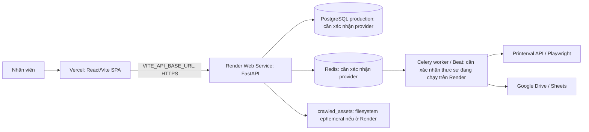
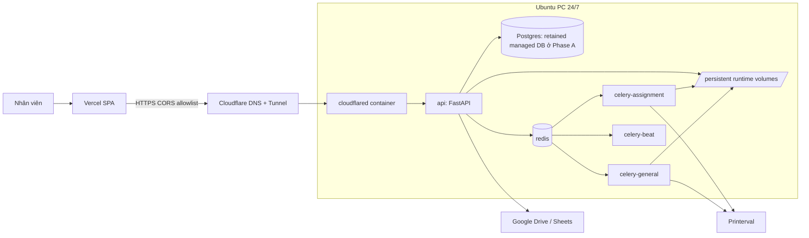

# Kế hoạch chuyển backend production từ Render sang Ubuntu PC

**Trạng thái:** Planning only — chưa triển khai.  
**Ngày audit:** 2026-09-09  
**Phạm vi:** Giữ React SPA trên Vercel; chuyển FastAPI, Celery và các dịch vụ vận hành sang một Ubuntu PC chạy 24/7, công bố API qua Cloudflare Tunnel.

## 1. Kết luận từ audit repository

Repository là một React/Vite SPA và FastAPI API. Source ở commit `05490b5`.

| Thành phần | Hiện trạng đã xác minh | Nhận định migration |
| --- | --- | --- |
| Frontend | Vite build tĩnh; Vercel build `frontend`, rewrite SPA; frontend đọc `VITE_API_BASE_URL` | Giữ trên Vercel. Chỉ đổi biến này sang API domain mới và redeploy. |
| API | FastAPI, endpoint liveness là `GET /api/health`; CORS đọc `CORS_ORIGINS` | Đưa vào container `api`; không chạy `--reload` ở production. |
| Database | PostgreSQL, Alembic, là source of truth cho orders, platform accounts, assignment requests và lịch sử | Chưa được phép kết luận DB production hiện ở đâu từ Git. Không migrate DB ở cutover compute đầu tiên. |
| Queue/scheduler | Redis broker/backend; Celery Beat chạy status sync mỗi 300 giây | Redis + worker + Beat là bắt buộc; nếu thiếu, hàng đợi phân công/status sẽ nằm im. |
| Worker ưu tiên | Queue `assignment` xử lý ghi Designer/Status lên Printerval | Chạy worker riêng `assignment`; worker này có thể cần Chromium/Playwright fallback. |
| Crawler | HTTP-first; Playwright headless fallback, Chrome profile theo platform | Giữ persistent profile/evidence trên volume local; local PC cũng phù hợp hơn Render cho session Printerval. |
| File/runtime data | `crawled_assets`, `order_assets`, `platform_data`, browser profiles và evidence nằm trên filesystem; chỉ `crawled_assets` được static-mount | Phải bind mount/persist. Đây không thay PostgreSQL, nhưng mất chúng làm mất cache ảnh, source đã tải và session browser. |
| Google | Drive read-only verification và Sheets export dùng service-account file `credentials/google-service-account.json` | Mount secret file read-only hoặc inject qua secret mechanism; không commit. Không thấy OAuth callback. |
| Webhooks | Không tìm thấy endpoint webhook/OAuth callback/WebSocket/SSE trong source | Không có route cần đổi theo domain mới từ code hiện tại; vẫn phải kiểm tra dịch vụ ngoài Render. |

`docker-compose.yml` hiện chỉ dành cho development: Postgres và Redis dùng mật khẩu mặc định, public port 5432/6379, không có API/worker/Beat/Tunnel/restart policy. Không dùng nguyên file đó cho production.

## 2. Kiến trúc hiện tại

Các facts ngoài repo đã biết: Render service là `tacahu-backend`, URL trước đây là `https://tacahu-backend.onrender.com`, auto-deploy từ `main`, và có deploy commit `05490b5`. Audit HTTP ở thời điểm lập tài liệu trả về 404 cho `/api/health` và `/docs`, dù dashboard Render trước đó hiển thị Live. Cần kiểm tra log/start command/URL trước cutover; không suy luận rằng service đang hoạt động bình thường chỉ từ trạng thái deploy.

Vercel production URL/canonical domain chưa thể xác định từ Git. URL preview cũ trong `RUNME.md` không được xem là source of truth; phải lấy URL production từ Vercel dashboard.

## 3. Kiến trúc đích

### Quyết định kiến trúc

1. **Cloudflare Tunnel là ingress P0.** Không mở 8000, 5432 hay 6379 ra Internet. `cloudflared` gọi API qua Docker network/loopback; Cloudflare cung cấp HTTPS tại `api.<domain>`.
2. **Không cần Caddy/Nginx ở Phase A.** Chỉ có một public HTTP service và Cloudflare Tunnel đã TLS-terminate. Thêm reverse proxy sau này chỉ khi cần route nhiều service, rate limit nội bộ hoặc access log tập trung.
3. **Redis là bắt buộc.** Source đang dispatch `delay()` cho refresh/status/Printerval assignment và Beat đang chạy scheduled sync.
4. **Hai worker và Beat là bắt buộc.** Chạy một general worker, một assignment worker và một Beat container. Không chạy nhiều Beat instance.
5. **Cloudflare Access để P1.** App đã có đăng nhập/role. Bật Access ngay trên API sẽ làm browser từ Vercel cần thêm Access flow; chỉ bật sau khi test trọn luồng hoặc khi frontend cũng nằm trong cùng Access policy.
6. **Object storage chưa phải P0.** `crawled_assets` là cache có thể crawl lại. Dùng persistent host volume và backup metadata/database trước. Đánh giá S3/R2 ở P1 khi dung lượng, recovery time hoặc số file khiến host volume không còn phù hợp.
7. **Database: giữ managed DB hiện tại ở Phase A, nếu kết nối an toàn được.** Lý do: compute cutover đã đủ rủi ro; giữ cùng database cho phép rollback Render nhanh và không copy dữ liệu nghiệp vụ. Nếu DB hiện là private Render Postgres không thể kết nối từ PC, không biến nó thành public chỉ để dùng tạm: thực hiện migration database riêng có backup + restore rehearsal trước. Chỉ quyết định DB local sau Render audit ở Milestone 0.

## 4. Render → local mapping

| Trách nhiệm Render | Thay thế local | Điều kiện hoàn tất |
| --- | --- | --- |
| Web Service FastAPI | `api` container, `uvicorn` production command | Health, login, role checks và CRUD qua `api.<domain>` đạt. |
| Render environment | `/opt/pinterval/.env` quyền 0600 hoặc Docker secret | Mapping từng biến, không copy mù, không vào Git. |
| PostgreSQL | Giữ managed DB Phase A; local Postgres chỉ ở migration DB riêng | Backup verified và rollback path rõ. |
| Redis | `redis` container private, persistent AOF/volume theo quyết định Phase A | API enqueue và cả ba consumers hoạt động. |
| Background work | `celery-general`, `celery-assignment`, `celery-beat` containers | Một assignment request chuyển lifecycle; scheduled status sync chạy. |
| Ephemeral filesystem | Bind volumes dưới `/srv/pinterval` | Thumbnail cache, browser profile, evidence và order asset còn sau recreate/reboot. |
| Public TLS/domain | Cloudflare Tunnel hostname `api.<domain>` | Không có inbound firewall port cho API; HTTPS valid. |
| Render log/health | Docker log rotation + Uptime Kuma monitor `/api/health` | Có alert khi public API lỗi. |
| Render deploy | SSH/manual release script ban đầu | Deploy theo commit SHA, migration controlled, health check và rollback được. |

## 5. Gap analysis

### P0 — bắt buộc trước cutover

- Audit Render thật: service type, build/start command, root directory, instance plan, database provider/host/public-private network, Redis provider, persistent disk, all environment names, workers/cron services, custom domain và logs lỗi 404.
- Chốt canonical Vercel production origin và API domain Cloudflare; không dùng URL preview cũ.
- Tạo Dockerfile production có Python dependencies và Chromium/Playwright dependencies cho worker cần fallback; tạo production Compose gồm API, Redis, general worker, assignment worker, Beat, cloudflared.
- Tách production config khỏi compose development: không mount source code, không `--reload`, không default database credentials, không publish database/Redis ports, restart policies, health checks, log rotation.
- Thiết kế secret mapping: `DATABASE_URL`, `REDIS_URL`, `SECRET_KEY`, `COOKIE_SECURE`, `CORS_ORIGINS`, Cloudflare token, Printerval/Google secret file và những biến Render audit phát hiện. Bảo toàn đúng `SECRET_KEY` cũ trong Phase A để session đã phát hành không bị invalid bất ngờ, hoặc công bố maintenance/logout có chủ đích.
- Persist `/srv/pinterval/{crawled_assets,order_assets,platform_data,chrome-profiles,playwright-evidence}`. Xác định quyền owner không-root và retention cho evidence.
- Khắc phục cách frontend dùng path `/crawled_assets/...`: production Vercel không proxy path này như dev server. Trước cutover phải bảo đảm client nhận absolute `api.<domain>/crawled_assets/...` hoặc Vercel có rewrite/proxy chính xác. Đây là P0 vì asset local path sẽ sai origin sau khi API tách frontend.
- Backup database trước rehearsal/cutover, kiểm tra restore trên DB riêng; chụp version Alembic và số bản ghi quan trọng.
- UFW inbound deny mặc định; SSH key-only theo policy; backend/DB/Redis không public; Docker tự start sau reboot.
- Test worker/Beat, Google service account, cookie-only platform, password+Playwright fallback, manual refresh và assignment sync trên API local trước DNS switch.

### P1 — triển khai ngay sau khi ổn định

- Readiness endpoint kiểm tra DB/Redis, có timeout; giữ `/api/health` là liveness đơn giản.
- Uptime Kuma + alert, host disk/RAM/CPU check, kiểm tra backup success. Không cần Prometheus/Grafana ở Phase A.
- Release script theo commit SHA (`fetch`, checkout exact SHA, build, migrate, start, health check) và tài liệu rollback. Không tự deploy mỗi push trước khi manual flow ổn định.
- Daily backup offsite nếu dùng local Postgres; dù giữ managed DB vẫn phải xác minh backup provider và định kỳ `pg_dump` test.
- Đánh giá Cloudflare Access sau test cross-origin login; đặt giới hạn access phù hợp internal users.
- Cải thiện request IDs/log structure và redaction để không ghi cookie/password/token.

### P2 — chỉ khi có nhu cầu thực tế

- Migrate PostgreSQL vào local PC sau một phase độc lập, hoặc chuyển đến managed DB khác để giảm single-PC risk.
- R2/S3 cho runtime assets/evidence, lifecycle policy.
- GitHub Actions/CD tự động deploy, sau khi manual release + rollback đã được diễn tập.
- Prometheus/Grafana, reverse proxy riêng, multi-node HA. Không cần cho khoảng 100 người dùng hiện tại.

## 6. Milestones triển khai đề xuất

| Mốc | Phạm vi nhỏ | Kiểm chứng/exit criteria |
| --- | --- | --- |
| 0. Preflight/audit | Export Render config **tên biến và metadata, không đưa secret vào tài liệu**; xác định DB/Redis/domain/worker; backup | Có inventory ký xác nhận, backup restore test, quyết định DB Phase A. |
| 1. Portable stack | Dockerfile + production Compose + env example + volume layout + log rotation | `docker compose config`, build, unit/type tests; local production-like stack lên được. |
| 2. Server bootstrap | Ubuntu user, Docker, UFW, disk layout, disable sleep, reboot policy, secret files | Reboot PC tự khôi phục containers; 8000/5432/6379 không nghe public. |
| 3. Private validation | Connect database safely, `alembic upgrade head` only after backup; test API via LAN/loopback | Login, authz, order read/write, Redis enqueue, workers/Beat, Google and Printerval integration pass. |
| 4. Tunnel + Vercel staging | Create `api.<domain>`, Cloudflare Tunnel, CORS allowlist, point Vercel Preview/staging env | Browser Vercel preview calls API, auth works, assets render, no mixed-content/CORS errors. |
| 5. Controlled cutover | Switch Vercel Production `VITE_API_BASE_URL`, redeploy; observe | All critical paths and scheduled sync work; Render remains untouched fallback. |
| 6. Stabilize/decommission | 7–14 days monitoring, recovery drill, final docs; only then remove Render compute | Approved decommission checklist; DB decision and fallback retirement explicit. |

Each implementation milestone must run relevant backend tests, frontend typecheck/build, Compose validation, and its listed live verification before proceeding.

## 7. Cutover plan

1. Freeze schema-changing deploys; capture current commit SHA, Alembic revision and Render service configuration.
2. Verify fresh database backup and a restore rehearsal. Confirm old Render and local stack point to the intended same DB only in Phase A.
3. Bring local stack up behind a temporary Tunnel hostname; test with a Vercel Preview environment and a test admin account. Do not alter production Vercel yet.
4. Verify critical product paths: login, platform switch isolation, list/detail assets, manual scan/refresh, status sync, internal assignment, external Printerval assignment, designer task/result submission, Google Drive verification, Celery retry/dead-letter visibility.
5. Verify scheduled Beat does not duplicate: stop/disable corresponding Render worker/Beat **only after** local worker/Beat pass. The API-only Render fallback may remain.
6. During a low-activity window, set Vercel Production `VITE_API_BASE_URL=https://api.<domain>` and redeploy. Set exact production Vercel origin in `CORS_ORIGINS`.
7. Verify from a clean browser session and observe API/worker logs, queue depth, DB connection/errors and asset URLs for at least one complete scheduled cycle.
8. Retain Render service, its environment and documented previous URL untouched for 7–14 days. Do not cancel Render DB if it remains Phase A database.

## 8. Rollback to Render

Rollback trigger: authentication failure, data-write errors, queue workers not processing, material Printerval sync failure, or loss of PC/tunnel availability beyond the agreed window.

1. Stop local Beat first to avoid duplicate scheduled jobs.
2. Keep database unchanged. This is why Phase A retains the same managed DB.
3. Restore Vercel Production `VITE_API_BASE_URL` to the recorded Render API URL and redeploy, or change the documented API DNS route if the frontend uses the stable custom API hostname.
4. Start/confirm Render worker/Beat before re-enabling scheduled operations. Verify health, login and one read-only status sync.
5. Preserve local logs/evidence and record the incident; do not run a database restore during an application-only rollback.

If the database is later moved local, this simple rollback is no longer valid. That future phase needs its own replication/export strategy and a separate approved rollback design.

## 9. Outside-repository inputs required

- Canonical Vercel production URL and permission to edit `VITE_API_BASE_URL`.
- A domain managed in Cloudflare and permission to create DNS/Tunnel hostname; preferred `api.<company-domain>`.
- Render dashboard audit: environment variable **names**, start/build commands, service/worker/cron inventory, DB/Redis details, custom domain and recent service logs. Send sensitive values only through a secure secret channel, never Git or docs.
- Ubuntu PC details: CPU/RAM/SSD free space, LAN connectivity, public outbound Internet, physical location, UPS availability, BIOS “restore after AC loss”, and permission to install Docker/Cloudflared.
- Security policy for SSH users/allowed source IPs and backup retention/offsite location.
- Google service-account credential file and confirmation it can access the expected Drive/Sheets resources.
- Cloudflare Tunnel token and required Printerval session material must be entered directly on the server secret store; no value is to be committed.

## 10. Main risks and mitigations

| Risk | Impact | Mitigation |
| --- | --- | --- |
| Single PC loses power/network/disk | API and background work unavailable | Ethernet, UPS, BIOS recovery, Docker restart policies, monitoring, documented Render rollback. |
| Duplicate Beat / duplicate worker during transition | Repeated status/crawl/external writes | One active Beat owner at a time; explicit stop/start checklist. |
| DB location unknown or private Render network | Local stack cannot connect, unsafe rushed DB exposure | Resolve in Milestone 0; never expose Postgres publicly; use separate DB migration plan if needed. |
| Session/cookie tied to egress/browser profile | Printerval requests fail after migration | Preserve platform-scoped credentials/profiles securely; validate on local host before production switch. |
| Vercel/API different origins | Login/CORS/assets fail | Exact CORS production origin, preview test, token/auth test, absolute asset URL strategy. |
| Runtime files lost on recreate | Missing thumbnails, source cache and browser session | Explicit host volumes, backup policy, re-crawl recovery procedure. |
| Secret leakage in Compose/logs/docs | Compromise of accounts/integrations | `.env` 0600/secrets, redaction, `.gitignore`, only `.env.example` in Git. |
| Render fallback was never tested | Rollback extends outage | Preserve Render config and perform one documented rollback rehearsal before decommission. |

## 11. Approval gate

No Dockerfile, production Compose, server change, Tunnel, DNS, database migration, Vercel variable change, or Render change is made by this planning phase. Implementation starts only after review and approval of this architecture and migration plan.
