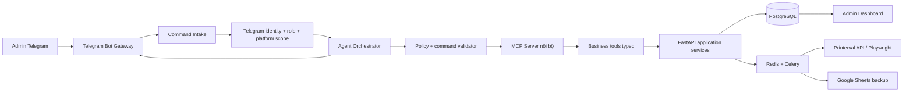
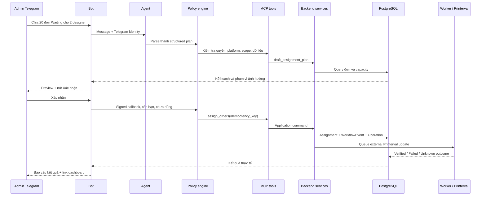

# V2 — Telegram Agent Control Plane

**Trạng thái:** Draft — boundary Agent/Printerval đã chốt; còn các quyết định sản phẩm và vận hành khác  
**Phạm vi:** Admin điều hành Tacahu Ops qua Telegram; web dashboard vẫn là nơi kiểm tra, audit và xử lý ngoại lệ.

## 1. Mục tiêu

Tạo một agent được host cùng hệ thống Tacahu Ops để admin có thể hỏi, ra lệnh và theo dõi vận hành qua Telegram, ví dụ:

```text
Ở acc thuyhg, kiểm tra các đơn Fix quá 24 tiếng.
Chia 20 đơn Waiting cho Hêm 10 đơn, Be 10 đơn.
Cho tao báo cáo hôm nay: bao nhiêu đơn nộp, Review, Fix, Done.
Kiểm tra des nào chưa nộp bài hôm nay.
Đánh dấu đã thanh toán cho các đơn của Hêm ngày 18/09.
```

Telegram là lớp giao tiếp cho admin. PostgreSQL, application service và state machine vẫn là nguồn quyết định duy nhất cho dữ liệu, quyền hạn và thay đổi trạng thái.

## 2. Nguyên tắc kiến trúc

1. Agent không truy cập PostgreSQL trực tiếp.
2. Agent chỉ gọi MCP tool nghiệp vụ có schema, scope platform, authorization và audit rõ ràng.
3. Agent không gọi Playwright/Selenium primitive như selector, click, type hay tọa độ.
4. Website Printerval, Google Sheets và Telegram là external integration; PostgreSQL là source of truth.
5. Command có side effect phải có idempotency key, operation record, evidence và retry có kiểm soát.
6. Timeout sau external write phải chuyển `UNKNOWN_OUTCOME`, reconcile trước khi retry.
7. Telegram callback xác nhận phải opaque, ký số, một lần dùng, có expiry và gắn với đúng admin/platform.
8. LLM chỉ hiểu intent, lập kế hoạch, tóm tắt và gọi tool whitelist. LLM không tự quyết state transition.
9. Dữ liệu từ Printerval, order note và chat đều là input không đáng tin cậy; không được coi là system instruction.
10. Không gửi password, cookie Printerval, token, private key hoặc dữ liệu nhạy cảm vào Telegram hay prompt LLM.

### 2.1 Rule bắt buộc: Agent chỉ thao tác Tacahu

```text
Admin ── Web Tacahu hoặc Telegram ──> Agent / API Tacahu ──> PostgreSQL + application service
                                                              └──> Worker Tacahu ──> Printerval
```

1. Admin có hai giao diện ngang quyền:
   - Web Tacahu: thao tác trực tiếp qua UI.
   - Telegram: hỏi hoặc ra lệnh cho chatbot; chatbot gửi request đã xác thực tới agent để lấy dữ liệu hoặc tạo command trên Tacahu.
2. Agent chỉ được gọi MCP tool và application service của **Tacahu**. Agent không có network credential, database credential, cookie, session hay quyền browser đối với Printerval.
3. Agent không được đọc, ghi, đăng nhập, crawl, đổi status, đổi designer hoặc upload lên Printerval bằng API, Playwright, Selenium hay bất kỳ browser primitive nào.
4. Chỉ backend/worker Tacahu được sở hữu adapter Printerval và credential Printerval. Luồng này giữ nguyên authorization, idempotency, audit, retry và reconciliation đã có.
5. Vì vậy, agent có thể yêu cầu Tacahu thực hiện một command nội bộ đã được admin xác nhận, ví dụ `assign_orders` hoặc `change_printerval_assignment`. Nếu policy cho phép, Tacahu mới tạo request/worker để đồng bộ sang Printerval. Đây là **tác động gián tiếp qua Tacahu**, không phải agent thao tác Printerval.
6. Nếu policy của mày là cấm cả tác động gián tiếp lên Printerval, các tool agent chỉ được read-only hoặc ghi state/note nội bộ Tacahu. Agent sẽ không thể đổi status/designer thực tế trên Printerval.
7. Agent không được bypass state machine, gọi adapter trực tiếp hoặc tự retry một external write chưa được Tacahu reconcile.

**Quy tắc ngắn:** Telegram và agent là client của Tacahu; Tacahu là client duy nhất của Printerval.

**Quyết định đã chốt:** Agent được tạo command trên Tacahu sau khi đúng policy và có xác nhận khi cần. Tacahu sau đó có thể đồng bộ kết quả sang Printerval bằng backend/worker hiện có. Agent tuyệt đối không được thao tác trực tiếp với Printerval.

## 3. Kiến trúc tổng thể



### 3.1 Thành phần mới

| Thành phần | Trách nhiệm |
|---|---|
| `telegram-gateway` | Nhận webhook Telegram, xác minh secret, chống replay, đẩy command vào queue |
| `agent-service` | Quản lý conversation, gọi model, tạo structured command, áp policy và gọi MCP |
| `tacahu-ops-mcp` | Expose tool typed nội bộ; không public Internet |
| `command-policy` | Phân loại read/write/high-impact, xác nhận, scope platform, giới hạn batch |
| `agent-dashboard` | Audit command, approval queue, tool failures, rules và link drill-down |
| `model-provider` | Interface thay thế được giữa API model bên ngoài và model self-host |

Khuyến nghị ban đầu: `telegram-gateway`, MCP và agent có thể nằm trong một service nội bộ để giảm vận hành. Tách service khi tải hoặc yêu cầu bảo mật tăng.

### 3.2 Luồng command ghi dữ liệu



## 4. MCP contract

MCP chỉ chạy trong private Docker network. Bot và LLM không giữ credential Printerval hoặc database credential.

### 4.1 Tool đọc dữ liệu

| Tool | Tác dụng |
|---|---|
| `get_workspace_summary` | Waiting, Doing, Review, Fix, Done, SLA và cảnh báo theo Acc Mẹ |
| `search_orders` | Tìm đơn theo mã, designer, status, ngày, duplicate, thiếu temp |
| `get_order_detail` | Chi tiết đơn, history, note, submission và trạng thái Printerval |
| `get_designer_performance` | WIP, nộp bài, Review, Fix, Done, công lao |
| `get_finance_summary` | Công lao, đã/chưa thanh toán, theo designer/kỳ |
| `get_exception_queue` | Thiếu temp, Fix, Review quá hạn, sync lỗi |
| `get_platform_health` | Crawl, status sync, worker, external request, backup Sheet |

### 4.2 Tool ghi dữ liệu

| Tool | Chính sách mặc định |
|---|---|
| `draft_assignment_plan` | Không ghi dữ liệu |
| `assign_orders` | Bắt buộc Telegram confirmation |
| `update_order_note` | Xác nhận nếu scope nhiều đơn |
| `resolve_template_missing` | Xác nhận nếu cập nhật nhiều đơn |
| `request_status_sync` | Có thể trực tiếp nhưng giới hạn scope |
| `change_printerval_assignment` | Bắt buộc confirmation và lifecycle hiện có |
| `mark_orders_paid` | Bắt buộc confirmation, hiện đơn và tổng tiền |
| `create_business_rule` | Chỉ tạo draft; phải duyệt riêng để activate |
| `retry_failed_operation` | Chỉ sau reconciliation hợp lệ |

MCP tool gọi application service/facade, không gọi route HTTP tùy tiện và không duplicate business logic trong agent.

## 5. Command policy

| Cấp độ | Ví dụ | Hành vi |
|---|---|---|
| Read-only | Tìm đơn, báo cáo team, xem finance | Trả lời ngay |
| Draft | Đề xuất chia đơn, đề xuất rule | Trả preview, không ghi |
| Confirmed write | Phân công, note, sync status, payment | Preview chi tiết rồi bắt buộc xác nhận |
| High impact | Bulk payment, bulk status, rule activate, credential/platform action | Xác nhận riêng, batch limit, audit tăng cường |
| Disallowed ban đầu | Xóa dữ liệu, sửa credential, bypass approval, raw browser action | Không expose qua Telegram |

Mỗi command phải có:

```text
command_id
telegram_message_id
actor_user_id
telegram_identity_id
platform_id
intent
structured_payload
idempotency_key
status
confirmation_expires_at
tool_calls
operation_ids
result_summary
```

## 6. Data model cần bổ sung

| Bảng | Nội dung |
|---|---|
| `telegram_identities` | Telegram user/chat ID, user nội bộ, allowlist, trạng thái link |
| `agent_conversations` | Context tối thiểu theo admin/chat/platform |
| `agent_runs` | Model, prompt version, thời gian, trạng thái và lỗi |
| `agent_tool_calls` | Tool, input đã redaction, output, latency, trạng thái |
| `command_requests` | Câu lệnh, structured command, platform, scope, lifecycle |
| `command_confirmations` | Callback, signature, expiry, single-use, actor |
| `business_rules` | Rule key, scope, condition/action JSON, version, hiệu lực, approval |
| `notification_deliveries` | Delivery Telegram, retry, provider result |
| `order_status_events` | Lịch sử external status Waiting/Doing/Review/Fix/Done |
| `daily_metric_snapshots` | Aggregate theo ngày/platform/designer cho dashboard |

`order_status_events` cần tách khỏi `WorkflowEvent` vì external status Printerval là mirror riêng. Event cần ghi `old_status`, `new_status`, `observed_at`, `source`, `order_id`, `platform_id`.

## 7. Dashboard mở rộng

### 7.1 Command Center

```text
[ Platform ] [ Khoảng thời gian ] [ Làm mới ]

[ Chờ xử lý ] [ Doing ] [ Review ] [ Fix ] [ Done hôm nay ]

[ Cảnh báo cần xử lý ]          [ Luồng đơn theo ngày ]
- Review quá SLA                - Created / Review / Done
- Fix quá SLA
- Thiếu temp
- Crawl / Sync lỗi

[ Khối lượng theo Designer ]    [ Chất lượng ]
- WIP                           - Fix rate
- Review / Done                 - First-pass review
- Đơn lâu nhất                  - Missing template

[ Sức khỏe hệ thống ]
- Crawl / Sync / Worker / Backup Sheet
```

### 7.2 Team Performance

| Designer | Doing | Review | Fix | Done | Nộp bài | Fix rate | Cycle time | Đơn lâu nhất |
|---|---:|---:|---:|---:|---:|---:|---:|---:|

Khi click designer, admin thấy order đã làm, timeline trạng thái, submission, Fix, công lao và workload theo ngày/tuần.

Tách hai chỉ số:

- **Đã nộp bài:** nguồn cho công lao theo rule hiện tại.
- **Review/Fix/Done:** nguồn cho vận hành và chất lượng.

### 7.3 Agent Operations

```text
[ Agent đang hoạt động ] [ Chờ xác nhận ] [ Tool lỗi ] [ Cần reconcile ]

Lệnh gần đây
- Admin/chat nào
- Platform nào
- Agent hiểu lệnh gì
- Tool đã gọi
- Kết quả thực tế
- Link tới đơn/dashboard

Rule đang hiệu lực
- Scope, version, hiệu lực, creator, approver
- Tắt hoặc chuyển draft
```

## 8. Roadmap

### Phase 0 — Product contract và governance

- Chốt command catalogue.
- Chốt read/write/high-impact policy.
- Chốt platform scope và Telegram allowlist.
- Chốt retention và redaction cho chat/audit.
- Chốt model provider policy.
- Viết threat model: Telegram takeover, duplicate message, prompt injection, sai platform, external timeout.

**Definition of done:** tool spec, command policy, RBAC matrix, threat model và acceptance criteria được duyệt.

### Phase 1 — Tool foundation và observability

- Tách typed business tool facade từ application service hiện có.
- Migration cho command/audit/Telegram/rule data model.
- Thêm `order_status_events` và daily metric snapshot.
- Build private MCP server.
- Test cross-platform authorization, idempotency, retry, reconciliation.

**Definition of done:** MCP tool có contract test; không thể replay write trùng hoặc truy cập chéo platform.

### Phase 2 — Mock agent và sandbox

- Chat simulator web hoặc CLI nội bộ.
- Dataset sandbox và executor dry-run.
- Parse tiếng Việt thành structured command.
- Chỉ read-only và draft plan.
- Mock preview, confirm, cancel, failure, retry.

**Definition of done:** admin thử được báo cáo và kế hoạch chia đơn mà không thay đổi dữ liệu production.

### Phase 3 — Telegram read-only và notification

- Telegram Bot webhook, secret validation, rate limit.
- Link Telegram identity với admin bằng code tạo từ web.
- Query dashboard, order, designer, finance, exception.
- Gửi thông báo crawl/sync/backup lỗi, Fix, thiếu temp.
- Deep link về dashboard.

**Definition of done:** bot luôn trả dữ liệu đúng platform và chưa có write capability.

### Phase 4 — Confirmed write commands

- Inline confirmation ký số, expiry và single-use.
- Chia đơn, cập nhật note, sync status, payment với preview.
- Kết quả chỉ báo completed sau khi worker đã có outcome verified.
- Audit link từ Telegram message đến operation/workflow event.

**Definition of done:** một command write truy được toàn bộ lifecycle từ chat đến external result.

### Phase 5 — Controlled autonomy

- Daily report tự gửi.
- Cảnh báo SLA.
- Tự tạo draft phân công theo capacity/rule.
- Tự tạo exception queue.
- Không tự payment, external status, assignment hoặc activate rule khi chưa có policy explicit.

**Definition of done:** agent tự chuẩn bị việc và cảnh báo chính xác; action nhạy cảm vẫn có approval.

### Phase 6 — Dashboard hiệu suất và tối ưu

- Command Center.
- Team Performance.
- Quality & Exception Center.
- Integration Health.
- Agent Operations.
- Metrics: command success, cancellation rate, tool failure, latency, retry, confirmation conversion.

## 9. Deployment đề xuất

Production Compose sẽ thêm tối thiểu:

```text
api
postgres
redis
celery-general
celery-assignment
celery-beat
telegram-gateway
agent-service
tacahu-ops-mcp
```

Không cần n8n ở Phase 1 vì Celery Beat đã quản lý scheduled job. Chỉ thêm n8n sau này nếu cần nối hệ thống bên ngoài hoặc muốn một workflow visual riêng; n8n không được giữ state machine, authorization hay business rule phức tạp.

Không nên chốt model self-host trước khi xác định CPU/RAM/GPU VPS. Một model provider interface cho phép khởi đầu bằng API model và đổi sang self-host sau mà không phải đổi business tools.

## 10. Security và rủi ro

| Rủi ro | Biện pháp |
|---|---|
| Telegram account bị chiếm | Allowlist Telegram ID, link code, revoke từ web, callback expiry |
| Command bị gửi lặp | Dedupe theo Telegram update/message ID và idempotency key |
| LLM hiểu sai | Structured command validator, preview, confirmation, batch limit |
| Prompt injection từ note/order | Treat external text as data; không cho nó override policy/tool scope |
| Sai platform | Platform derive từ identity, explicit scope, tool-level authorization |
| Timeout Printerval | `UNKNOWN_OUTCOME`, evidence, reconcile trước retry |
| Rò rỉ secret | Redaction, secret manager/env, không log/send credential |
| Agent tự hành quá mức | Policy boundary, human confirmation, kill switch |

## 11. Câu hỏi cần chốt

1. Chỉ admin dùng Telegram, hay Support cũng được hỏi dữ liệu?
2. Những lệnh nào bot được thực hiện sau một lần xác nhận: chia đơn, status, payment, rule, crawl?
3. Mỗi admin Telegram mặc định ở một platform, hay luôn phải ghi rõ platform trong lệnh?
4. Bot dùng chat riêng, group Telegram, hay cả hai?
5. Dữ liệu có được gửi qua LLM API bên ngoài không, hay bắt buộc self-host model?
6. Bot có gửi báo cáo/cảnh báo chủ động không? Loại nào ưu tiên trước?
7. Muốn Phase 2 mock hoàn toàn trong web trước, hay nối Telegram read-only ngay sau tool foundation?
