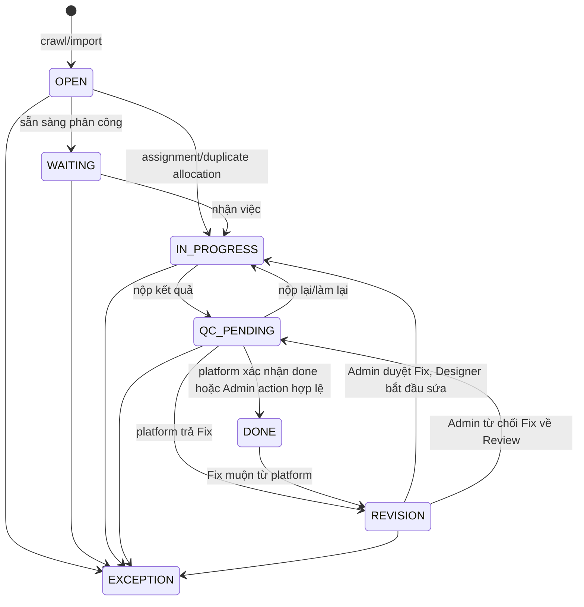

# Luồng đơn hàng hiện hành

## Role và domain

- `admin`: quản trị platform, user, phân loại/phân công, state, Fix, tài chính và audit.
- `support`: phân loại duplicate, xem/duyệt danh sách bài nộp; không có quyền Admin tổng quát.
- `designer`: chỉ làm assignment standard của chính mình.
- `designer-trello`: làm duplicate domain trên board cộng tác; đây là ngoại lệ visibility có chủ đích.

Mỗi order thuộc một `platform_id`. Mọi query/command order phải bị scope theo platform.

## State canonical

State lưu hiện tại chỉ gồm `OPEN`, `WAITING`, `IN_PROGRESS`, `QC_PENDING`, `REVISION`,
`DONE`, `CANCELLED`, `EXCEPTION`.

Các state cũ/ngoài (`DISCOVERED`, `ASSIGNED`, `RESULT_SUBMITTED`, `FIX`, `SKIPPED`, ...)
được normalize khi đọc để tương thích dữ liệu cũ, không phải state canonical mới.

`EXCEPTION` chỉ được rời bằng recovery tường minh của operator; state-machine cho phép
transition nhưng application layer không được tự động recover.

## Luồng chuẩn

1. **Crawl/refresh**: worker hoặc Admin lấy job/platform detail, asset, gallery, custom
   configuration và metadata. Import tạo/mapping order về `OPEN` hoặc `WAITING` theo
   command hiện hành; refresh metadata không tự đổi state.
2. **Phân loại**: Admin/Support đặt `work_domain` là `standard` hoặc `duplicate` và cập
   nhật duplicate check status. Standard được Admin phân công; duplicate vào Duplicate Board.
3. **Làm việc**: assignment approved hoặc Designer Trello nhận thẻ đưa order vào
   `IN_PROGRESS`. Assignment/status Printerval là write async, serialized trên queue
   `assignment`.
4. **Nộp bài**: Designer tạo `ResultVersion`, state sang `QC_PENDING`. Với flow hiện
   hành, worker đẩy Review/link/note sang Printerval và chỉ thực hiện khi order vẫn ở
   revision/state mong đợi.
5. **Đồng bộ status**: Celery Beat đọc status platform. `Done` đưa nội bộ sang `DONE`;
   `Fix` đưa sang `REVISION`, lưu note/source context và tăng `fix_return_count`.
6. **Fix**: Fix trước hết nằm ở Admin. Admin duyệt sẽ release hướng dẫn riêng cho
   Designer, Designer sửa và nộp lại Review. Admin từ chối Fix thì trả về `QC_PENDING`
   cùng ghi chú phản hồi cho platform. Không expose trực tiếp upstream `note_outsource`
   cho Designer.

## Duplicate Board

Duplicate là domain xử lý cộng tác, không phải state riêng. Designer Trello có thể thấy
card duplicate của cùng platform và link kết quả mới nhất trên board; điều này **không**
mở quyền tương tự cho Designer standard hay toàn bộ order detail/source.

## Thiếu template và Note làm việc

- Designer có thể flag thiếu temp. Order/assignment vào trạng thái chờ Admin xử lý;
  Admin dùng command resolve để thêm hướng dẫn/temp và đưa lại Doing.
- `Note làm việc` là cuộc trao đổi chung append-only giữa Admin và designer được phép.
  Có thể dán ảnh raster; file được lưu private và download qua endpoint có auth.
- Khi người còn lại thêm note, lần mở note tiếp theo trả cờ unread để UI hiện chấm xanh.
  Việc đọc ghi cursor theo từng `(order, user)`.
- `Note Outsource` là record upstream read-only; không dùng nó làm chat nội bộ.

## Điều không được giả định

- Không coi một request enqueue là external write thành công; phải kiểm tra state/evidence.
- Không để job async cũ ghi đè Fix/Review mới hơn.
- Không coi link Drive hoặc chat là approval bền vững; state/event/backend mới là authority.

