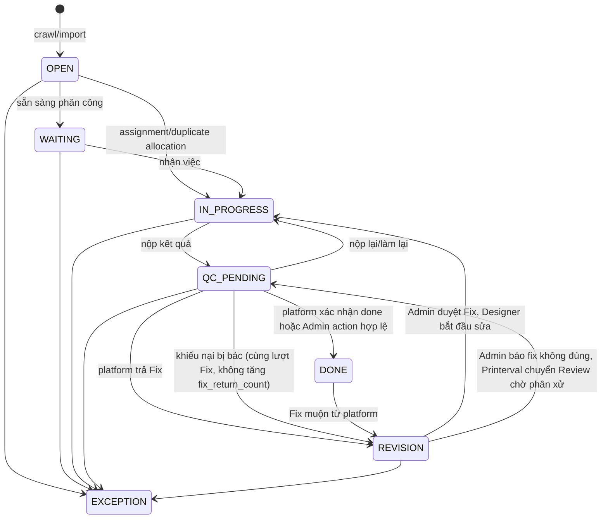

# Luồng đơn hàng hiện hành

## Role và domain

- `admin`: quản trị platform, user, phân loại/phân công, state, Fix, tài chính và audit.
- `support`: gắn tag trùng/không trùng cho đơn còn `Waiting` và xem/duyệt danh sách bài nộp;
  không có quyền Admin tổng quát. Support thấy mọi đơn `Waiting` và `Doing` của platform, chia
  thành bốn tab không chồng nhau (xem [architecture.md](architecture.md)); đơn Admin đã chia cho
  designer mà chưa gắn tag nằm ở tab `Đang làm` và chỉ xem. Đơn designer đã nộp bài không còn hiện
  với Support.
- `designer`: chỉ làm assignment standard của chính mình.
- `designer-trello`: làm duplicate domain trên board cộng tác; đây là ngoại lệ visibility có chủ đích.

Mỗi order thuộc một `platform_id`. Mọi query/command order phải bị scope theo platform.

## State canonical

State lưu hiện tại chỉ gồm `OPEN`, `WAITING`, `IN_PROGRESS`, `QC_PENDING`, `REVISION`,
`DONE`, `CANCELLED`, `EXCEPTION`.

Các state cũ/ngoài (`DISCOVERED`, `ASSIGNED`, `RESULT_SUBMITTED`, `FIX`, `SKIPPED`, ...)
được normalize khi đọc để tương thích dữ liệu cũ, không phải state canonical mới.

```mermaid
stateDiagram-v2
    [*] --> OPEN: crawl/import
    OPEN --> WAITING: sẵn sàng phân công
    OPEN --> IN_PROGRESS: assignment/duplicate allocation
    WAITING --> IN_PROGRESS: nhận việc
    IN_PROGRESS --> QC_PENDING: nộp kết quả
    QC_PENDING --> DONE: platform xác nhận done hoặc Admin action hợp lệ
    QC_PENDING --> REVISION: platform trả Fix
    REVISION --> IN_PROGRESS: Admin duyệt Fix, Designer bắt đầu sửa
    REVISION --> QC_PENDING: Admin báo fix không đúng, Printerval chuyển Review chờ phân xử
    QC_PENDING --> REVISION: khiếu nại bị bác (cùng lượt Fix, không tăng fix_return_count)
    QC_PENDING --> IN_PROGRESS: nộp lại/làm lại
    DONE --> REVISION: Fix muộn từ platform
    state EXCEPTION
    OPEN --> EXCEPTION
    WAITING --> EXCEPTION
    IN_PROGRESS --> EXCEPTION
    QC_PENDING --> EXCEPTION
    REVISION --> EXCEPTION
```

`EXCEPTION` chỉ được rời bằng recovery tường minh của operator; state-machine cho phép
transition nhưng application layer không được tự động recover.

## Luồng chuẩn

1. **Crawl/refresh**: worker hoặc Admin lấy job/platform detail, asset, gallery, custom
   configuration, **template của job** (ảnh, link PSD, note trong nút "Xem template của job" trên
   Printerval, lưu ở `orders.job_templates`) và metadata. Import tạo/mapping order về `OPEN` hoặc
   `WAITING` theo command hiện hành; refresh metadata không tự đổi state. Template được cập nhật theo
   crawl đơn Waiting và theo đồng bộ định kỳ đơn Doing/Fix; đơn đã Review/Done giữ bản đã lưu.
2. **Phân loại**: Admin/Support đặt `work_domain` là `standard` hoặc `duplicate` và cập
   nhật duplicate check status. Support chỉ được thực hiện bước này khi order còn ở
   `Waiting`; chỉ quyết định `duplicate` mới ghi người + thời điểm, timeline và công
   Support. Quyết định `non_duplicate` không tạo timeline/công Support. Standard
   được Admin phân công; duplicate vào Duplicate Board. Đơn chưa gắn tag mà đã được chia
   chuyển sang tab `Đang làm` của Support (chỉ xem).
3. **Làm việc**: assignment approved hoặc Designer Trello nhận thẻ đưa order vào
   `IN_PROGRESS`. Assignment/status Printerval là write async, serialized trên queue
   `assignment`.
4. **Nộp bài**: Designer gửi link **và 1–3 ảnh mockup (bắt buộc)**, tạo `ResultVersion`, state
   sang `QC_PENDING`. Admin nộp thay (form nộp bài ở chi tiết đơn) cũng phải gắn 1–3 ảnh mới; menu
   đổi trạng thái không còn chuyển thẳng sang Review cho bất kỳ ai (`PATCH /orders/{id}/state` sang
   Review luôn đòi `image_ids`). Worker đẩy sang Printerval theo thứ tự link → ảnh vào cột Design → trạng
   thái Review, và chỉ thực hiện khi order vẫn ở state mong đợi. Chi tiết ở "Chuyển đơn sang
   Review trên Printerval" bên dưới.
   **Nộp lại / đổi link** (Designer standard, không áp dụng cho Trello): đơn ở
   `QC_PENDING` hoặc `DONE` nội bộ vẫn nộp lại được cho tới khi `printerval_status` là
   `confirm`/`done` (sau đó trả 404). Link mới tạo `ResultVersion` kế tiếp (bản cũ giữ làm
   lịch sử), `ApprovalRequest` QC `pending` cũ chuyển `superseded`, đơn về `QC_PENDING`
   chờ QC lại, link mới được đẩy sang Printerval. Đơn Fix cũng dùng link Designer gửi;
   để trống thì giữ link bản nộp đầu. Lý do: Printerval đã có khung chat riêng nên link
   không còn là kênh ghi chú yêu cầu sửa.
5. **Đồng bộ status**: Celery Beat đọc status platform. `Done` đưa nội bộ sang `DONE`;
   `Fix` đưa sang `REVISION` và tăng `fix_return_count`. Tacahu **không đọc** `note_outsource`
   từ Printerval về nữa (nó chỉ giữ link bài Tacahu đã đẩy lên); QC ghi yêu cầu sửa vào khung
   chat của đơn trên Printerval — xem "Chat Printerval" bên dưới.
6. **Fix**: Fix trước hết nằm ở Admin (thẻ Telegram trích nguyên văn nội dung Fix trong chat,
   hoặc nút "Chấp nhận Fix" trên web). Admin duyệt thì Designer nhận **Ghi chú cho Designer**;
   Admin để trống thì Designer nhận nguyên văn nội dung Fix trong chat, ảnh qua proxy (chi tiết ở
   "Chat Printerval"). Designer sửa và nộp lại Review (lại kèm 1–3 ảnh mockup mới). Admin cho rằng
   Fix sai thì **Báo fix không đúng** (xem dưới), không còn tự đẩy đơn về Review. Designer không bao
   giờ thấy chat, `note_outsource` hay khiếu nại.

### Báo fix không đúng (khiếu nại Fix, Printerval từ 21/10/2026)

Thay cho "Từ chối Fix" cũ. Printerval nhận `POST /outsource/pod/design-job/fix-dispute`
`{id, note, images}` (đọc từ JS trang Printerval): lý do bắt buộc 10–1000 ký tự, tối đa 5 link ảnh
`http(s)`. Printerval chuyển job sang **Review ngay**, người review khác phân xử; job có
`outsource_fix_dispute = {round, status, note, at, arbiter_note, arbiter_at}` và
`outsource_fix_dispute_can` (được khiếu nại lúc này không).

1. Admin gửi trên web (modal giống Printerval ở danh sách đơn, chi tiết đơn, Tiến Độ Team) hoặc Telegram
   (nút "🚩 Báo fix không đúng" trên thẻ Fix → bot hỏi theo mẫu `LÝ DO: …` / `ẢNH:` mỗi link một dòng,
   sai thì báo lỗi và hỏi lại, đúng thì cho xem lại với nút **Gửi khiếu nại / Huỷ**).
   `POST /orders/{id}/fix-dispute` ghi `orders.fix_dispute` (`push=queued`) + `WorkflowEvent`
   `FIX_DISPUTE_SUBMITTED`, dọn thẻ Fix Telegram và đẩy task `send_fix_dispute_task` (queue `assignment`).
2. Task đọc job trước: đã có khiếu nại `pending` (lần gửi trước tới nơi nhưng mất phản hồi) thì **không gửi
   lại**; job không còn Fix hoặc `can=false` thì báo lỗi. Gửi xong đọc lại job, đơn sang `QC_PENDING`
   (`FIX_DISPUTE_TO_REVIEW`). Lỗi tạm thời thử lại sau 1/3/7 phút; bị từ chối hoặc hết lượt thử thì
   `push=failed`, ghi `dead_letters` (toast Admin) và Admin bấm **Gửi lại** (`/fix-dispute/retry`).
3. Đồng bộ trạng thái (cả 3 đường) đọc khiếu nại **trước** luật Fix/Review: `rejected` + job về `fix`
   → đơn về `REVISION` ngay (không chờ tin "Mở Fix", **không** tăng `fix_return_count`, gửi lại thẻ Fix
   kèm lời phân xử, nút khiếu nại ẩn đi) — `FIX_DISPUTE_REJECTED`; trạng thái khác `pending`/`rejected`
   khi job không ở Fix → `FIX_DISPUTE_ACCEPTED`.
4. Mỗi lượt Fix khiếu nại một lần: đã gửi hoặc bị bác thì nút bị khoá kèm lý do (`fix_dispute_blocked`).
5. Tỉ lệ Fix của Designer: khiếu nại được chấp nhận thì lần Fix đó không tính (`dispute_accepted`), bị bác
   thì vẫn tính.

## Chuyển đơn sang Review trên Printerval (luật Printerval từ 19/10/2026)

Printerval chỉ cho một job sang **Review** (kể cả job Fix nộp lại) khi có đủ:

1. link design trong `Note outsource`;
2. ít nhất một ảnh mockup/design trong **cột Design** của job trên tool Printerval.

Riêng job đang **Fix** còn phải: đọc hết tin của Printerval trong chat (còn tin chưa đọc thì
Printerval giữ job ở Fix), và nếu lý do Fix là **"Đổi template"** thì gửi kèm xác nhận
`template_confirm` = `agree`, hoặc `disagree` + `template_confirm_note` (giải thích, ≤ 500 ký tự).
Thiếu điều kiện nào Printerval từ chối PATCH `design-job/update` (thiếu xác nhận template thì trả
`code: template_confirm` kèm `outsource_fix_template`).

Tacahu đáp ứng như sau:

| Điều kiện | Tacahu làm |
|---|---|
| Link trong Note outsource | Designer dán link khi nộp; worker ghi lên Printerval (một chiều, không đọc ngược). |
| Ảnh trong cột Design | Designer **bắt buộc** gắn 1–3 ảnh PNG/JPEG (≤ 10 MB/ảnh) ở ô nộp bài; ảnh được tải trước (staged), lần nộp gắn chúng vào (`result_images`). Worker tải từng ảnh chưa có trên Printerval: `POST /printerval-central/upload` (lấy URL) rồi `POST /service/pod/design-job/store-image` (gắn vào job, ảnh đầu là primary khi job chưa có ảnh). Mỗi ảnh ghi `pushed_at` ngay khi Printerval nhận, nên thử lại không tải trùng; Review chỉ gửi khi mọi ảnh đã lên. |
| Đọc hết chat (job Fix) | Ngay trước khi đổi trạng thái của một job đang Fix, worker đọc chat của job (Printerval tính là đã đọc cho cả team). |
| Xác nhận "Đổi template" | Không tự quyết, luôn là Admin. **Hỏi trước, lúc duyệt Fix** (đường chính, xem dưới). Nếu Printerval vẫn từ chối lúc đẩy Review (đơn duyệt Fix từ trước khi có bước hỏi trước, hoặc QC mở thêm một câu hỏi template mới) thì **đường dự phòng**: không thử lại, ghi `dead_letters` (`kind=template_confirm`) và toast Admin; trang chi tiết đơn của Admin hiện khung **Xác nhận / Không đúng + lý do**. Admin trả lời (`POST /orders/{id}/printerval-template-confirm`, idempotent, ghi `WorkflowEvent` `CONFIRM_FIX_TEMPLATE`) → đơn về `QC_PENDING` và worker gửi lại Review kèm xác nhận. |

### Fix "Đổi template": Admin trả lời lúc duyệt Fix

Trên web Printerval, modal xác nhận chỉ **hiện ra lúc chuyển Fix → Review**, với hai nút: **Xác nhận FIX do
đổi template** (xong, đơn sang Review) và **Không đúng, không phải đổi template** (bắt buộc điền giải thích mới
cho sang Review). Printerval không chủ động hỏi lúc trả Fix, nhưng **lưu sẵn câu hỏi ngay khi QC trả Fix** với
lý do "Đổi template" (lần Fix, link, ghi chú QC điền). Modal lúc chuyển Review chỉ đọc lại bản lưu đó
(kiểm chứng 20/10: DJ4165458 câu hỏi tạo 14:09, des nộp lại 14:37; DJ4164886 tạo 12:52, nộp lại 13:51).
Tacahu đọc trước bản lưu này để hỏi Admin ngay lúc duyệt Fix, nên Designer nộp lại là đơn lên Review luôn:

1. **Biết đơn nào bị hỏi**: dòng Fix của đơn trên Printerval có `outsource_fix_template`
   (`{round, url, note, status}`); `status = "pending"` là đang hỏi (đơn Fix thường thì trường này `null`).
   Tacahu đọc nó khi đơn vào Fix (task `capture_order_chat`), khi Admin mở modal duyệt Fix
   (`GET /orders/{id}/fix-template`, cache 5 phút/đơn) và khi bấm "Chấp nhận Fix" trên Telegram, rồi lưu vào
   `orders.fix_template_confirm` (`round`, `url`, `note`). Qua lượt (`round`) mới thì câu hỏi và câu trả lời cũ bị
   thay; Printerval không còn hỏi (ai đó đã trả lời trên Printerval) thì xoá. Cần `ORDER_CHAT_ENABLED=true`
   (cùng cờ với đọc chat); tắt thì chỉ còn đường dự phòng.
2. **Admin trả lời** khi duyệt Fix:
   - Web (modal "Chấp nhận Fix" ở danh sách đơn và ở trang chi tiết/board): khối đỏ hiện link template + ghi chú,
     2 nút **Xác nhận Fix do đổi template** / **Không đúng, không phải đổi template**; chọn nút 2 thì hiện ô
     giải thích bắt buộc. Chưa chọn (hoặc thiếu giải thích) thì không duyệt được; backend cũng trả 422
     (`approve-fix` nhận `template_confirm` + `template_confirm_note`).
   - Telegram: bấm "Chấp nhận Fix" → bot hỏi câu hỏi template trước (2 nút tương ứng; "Không đúng" thì bot
     yêu cầu trả lời tin nhắn bằng lời giải thích), xong mới hỏi bước Ghi chú cho Designer như thường.
   Câu trả lời ghi vào `fix_template_confirm` (`decision`, `decision_note`, `decided_by`) và
   `WorkflowEvent` `ANSWER_FIX_TEMPLATE`; Admin sửa được tới khi đã gửi lên Printerval. Designer không thấy gì.
3. **Designer nộp lại Review**: worker đẩy như thường; ở bước đổi trạng thái, nếu câu trả lời đã lưu thuộc
   đúng lượt đang được hỏi (so `round` với dòng Printerval vừa đọc) thì gửi kèm `template_confirm`
   (+ `template_confirm_note`). Printerval nhận thì đánh dấu `sent_at` (đóng câu hỏi). Lượt khác thì **không**
   gửi câu trả lời cũ, Printerval từ chối và đường dự phòng chạy.
4. Admin duyệt Fix mà Tacahu không đọc được câu hỏi (Printerval chậm) thì không bị chặn; nếu Printerval hỏi
   thì đường dự phòng bắt lại.

**Không coi lệnh đẩy chưa tới là Fix mới.** Tacahu chuyển đơn sang Review nội bộ ngay rồi mới đẩy
lên Printerval; trong lúc đó Printerval vẫn báo Fix. Trong **30 phút** sau khi đơn sang Review
(hoặc khi đơn đang chờ Admin xác nhận template), trạng thái `fix` từ Printerval chỉ được tính là
Fix mới nếu chat có tin **"Mở Fix"** (`fix_open`) gửi sau thời điểm đó; quá 30 phút thì lấy Fix của
Printerval như cũ. Trước đây việc này đưa bài nộp lại về Fix giả (20/52 lần nộp lại ngày 19/10).

**Không im lặng khi thất bại.** Lệnh đẩy Review thử lại sau 1, 3, 7 phút; Printerval từ chối thì
toast kèm đúng lý do Printerval trả (HTTP code + message). Lệnh đã từng lỗi mà lần thử sau thấy đơn
đã đổi trạng thái cũng phải toast (trước đây nó tự bỏ qua).

Ngoài phạm vi: Admin đổi trạng thái tay sang Review không bắt buộc ảnh (Printerval vẫn có thể từ
chối nếu job chưa có ảnh — toast sẽ báo).

## Duplicate Board

Duplicate là domain xử lý cộng tác, không phải state riêng. Designer Trello có thể thấy
card duplicate của cùng platform và link kết quả mới nhất trên board; điều này **không**
mở quyền tương tự cho Support, Designer standard hay toàn bộ order detail/source.

## Thiếu template và Note làm việc

- Designer có thể flag thiếu temp. Order/assignment vào trạng thái chờ Admin xử lý;
  Admin dùng command resolve để thêm hướng dẫn/temp và đưa lại Doing.
- `Note làm việc` là cuộc trao đổi chung append-only giữa Admin và designer được phép.
  Có thể dán ảnh raster; file được lưu private và download qua endpoint có auth.
- Khi người còn lại thêm note, lần mở note tiếp theo trả cờ unread để UI hiện chấm xanh.
  Việc đọc ghi cursor theo từng `(order, user)`.
- `note_outsource` trên Tacahu chỉ là link bài đã nộp: Tacahu ghi lên Printerval một chiều (nộp lần đầu
  và mỗi lần Designer cập nhật link), không đọc ngược về; không dùng nó làm chat nội bộ.

## Chat Printerval (chỉ Admin, chỉ đọc)

QC của Printerval ghi yêu cầu Fix và nhận xét vào khung chat từng đơn. Tacahu đọc chat theo 3 cách,
đều chỉ cho Admin và không bao giờ đổi state đơn:

1. **Mở đơn**: `GET /orders/{id}/printerval-chat` lấy cả hội thoại ngay lúc đó (không lưu DB).
2. **Toast tin mới**: web Admin hỏi `GET /printerval-chat/unread` mỗi 30 giây khi tab đang xem; server
   hỏi Printerval 1 lần/phút/platform (danh sách unread của chính Printerval, không đánh dấu đã đọc) và
   cache. Mỗi đơn có tin mới hiện một toast.
3. **Đơn đổi status sang Fix/Confirm/Done**: job đồng bộ trạng thái đẩy task `capture_order_chat`, lưu
   tin mới của đơn vào `external_observations` (`source=printerval.chat`, tăng dần theo
   `last_message_id`). Đây là lưới an toàn cho tin đã được ai đó đọc trên Printerval nên không còn trong
   danh sách unread. Với Fix, task đọc chat **rồi** gửi thẻ Telegram cho Admin; đọc chat lỗi thì thẻ ghi
   "chưa đọc được khung chat" và việc đọc được thử lại sau 2 và 5 phút.

**Nội dung Fix** = toàn bộ tin của QC (không tính tin của mình) thuộc lượt Fix mới nhất trong các
snapshot (mỗi snapshot giữ tối đa 30 tin), cũ trước mới sau, mỗi tin một dòng, kèm ảnh (`fix_chat_text`).
QC hay nhắn nhận xét trước rồi mới bấm Fix; Printerval chỉ tăng số lượt (`fix_round`) lúc bấm Fix nên các tin
đó còn mang số lượt cũ. Chúng vẫn thuộc lượt Fix này nếu gửi **sau lần đơn sang Review gần nhất** trước tin
"Mở Fix" (`WorkflowEvent` sang `QC_PENDING`), dù mang số lượt nào (QC có thể bấm Fix nhiều lần trước khi des
nộp lại); tin cũ hơn thuộc các lần Fix trước nên không lấy (DJ4164173: 3 tin nhận xét rồi mới mở Fix).
Dùng ở:

- Thẻ Fix Telegram: trích nguyên văn (tối đa 3000 ký tự); dài quá 1024 ký tự thì gửi tin chữ thay ảnh.
- Chi tiết đơn (Admin): `fix_reason` là nội dung này; dòng trong danh sách đơn chỉ hiện tin QC mới nhất.
- Modal duyệt Fix trên web: hiện nội dung này cho Admin (`GET /orders/{id}/fix-chat`; chưa có snapshot
  thì đọc chat 1 lần ngay lúc đó, `read_fix_chat_text`).

Duyệt Fix (web modal, hoặc Telegram "Có, soạn Ghi chú Admin" / "Không, dùng nguyên văn nội dung chat"):
Admin nhập Ghi chú cho Designer thì des nhận đúng ghi chú đó; để trống thì copy nội dung Fix vào
`designer_note`, ảnh đi qua proxy ảnh của Tacahu (`Ảnh: /api/assets/proxy?u=…`, không lộ host Printerval; web
hiển thị thành "Ảnh 1, Ảnh 2…", tin Telegram gửi des thay bằng "(xem ảnh trên web Tacahu)"). Không có nội dung chat thì web trả 422, Telegram
báo bấm lại hoặc soạn ghi chú. Duyệt Fix không đọc hay ghi `note_outsource` (đó là link Tacahu đẩy lên).

Đọc tin nhắn làm Printerval đánh dấu **đã đọc cho cả team**. Designer không thấy chat; muốn designer biết,
Admin tự ghi vào Note làm việc. `ORDER_CHAT_ENABLED=false` tắt cách 2 và 3 (thẻ Fix Telegram vẫn gửi như cũ,
chỉ không kèm lý do); mở chat của một đơn luôn dùng được.

## Điều không được giả định

- Không coi một request enqueue là external write thành công; phải kiểm tra state/evidence.
- Không để job async cũ ghi đè Fix/Review mới hơn.
- Không coi link Drive hoặc chat là approval bền vững; state/event/backend mới là authority.
